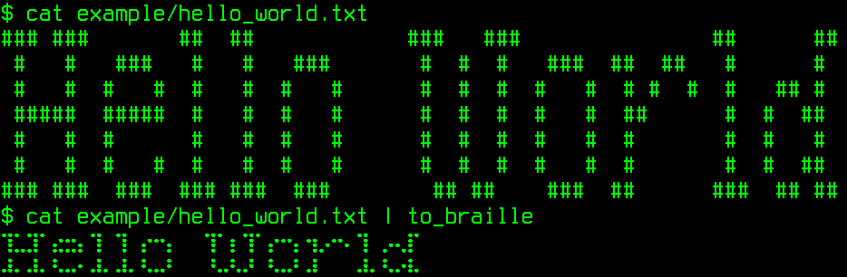

# to_braille

## What is Whalebrew?

https://github.com/whalebrew/whalebrew#readme

## Usage

```shell
$ cat example/hello_world.txt
### ###       ##  ##            ###   ###               ##      ##
 #   #   ###   #   #   ###       #  #  #   ###  ##  ##   #      #
 #   #  #   #  #   #  #   #      #  #  #  #   #  # #  #  #   ## #
 #####  #####  #   #  #   #      #  #  #  #   #  ##      #  #  ##
 #   #  #      #   #  #   #      #  #  #  #   #  #       #  #   #
 #   #  #   #  #   #  #   #      #  #  #  #   #  #       #  #  ##
### ###  ###  ### ###  ###        ## ##    ###  ##      ###  ## ##
$ cat example/hello_world.txt | to_braille
⢹⣁⣹⠁⣔⣒⡄⢹⠀⢹⠀⡔⠒⡄⠀⠀⢹⠁⡆⢹⠁⡔⠒⡄⢲⡠⠒⠄⢹⠀⡠⢄⡏
⠼⠄⠼⠄⠣⠤⠂⠼⠄⠼⠄⠣⠤⠃⠀⠀⠘⠤⠣⠜⠀⠣⠤⠃⠼⠀⠀⠀⠼⠄⠣⠔⠧
```



## Build

```shell
docker compose build
```

## Install

```shell
whalebrew install matefarkas/whalebrew-to_braille
```

## Run

```shell
to_braille
```

## Uninstall

```shell
whalebrew uninstall to_braille
```

---

This project was generated by [cookiecutter-whalebrew](https://github.com/farkasmate/cookiecutter-whalebrew).
